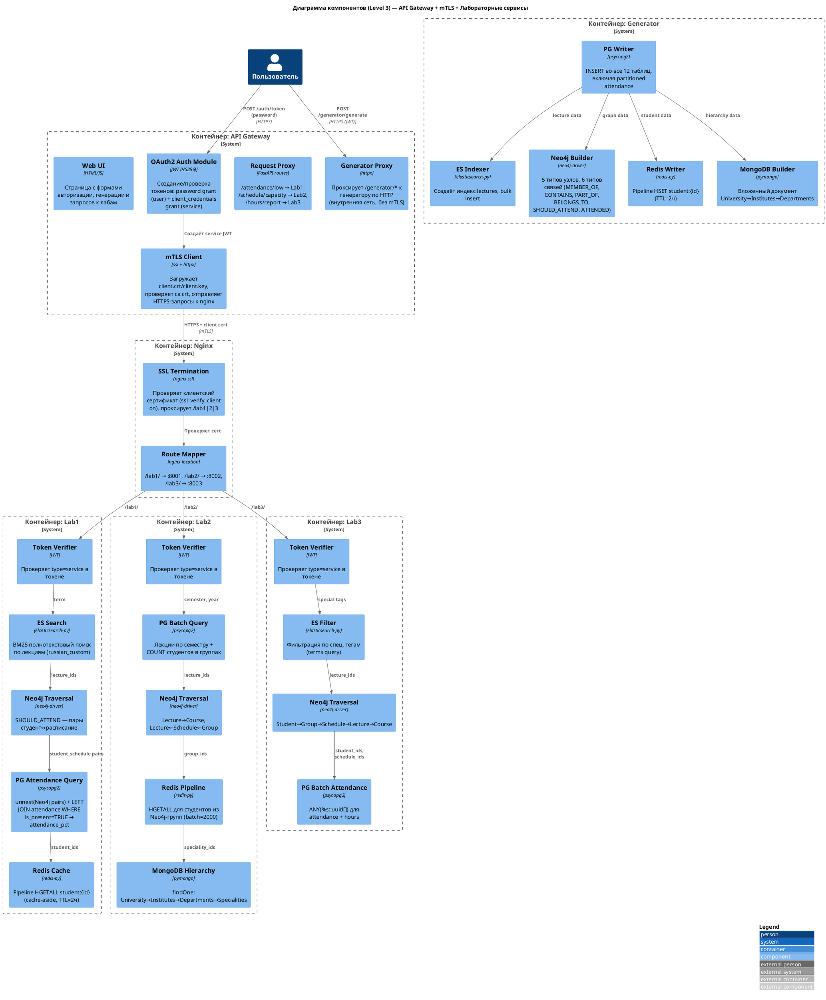

```plantuml
@startuml C4_Components
!include <C4/C4_Component>

LAYOUT_WITH_LEGEND()

title Диаграмма компонентов (Level 3) — API Gateway + mTLS + Лабораторные сервисы

System_Boundary(gateway_container, "Контейнер: API Gateway") {
    Component(auth_module, "OAuth2 Auth Module", "JWT (HS256)", "Создание/проверка токенов: password grant (user) + client_credentials grant (service)")
    Component(mtls_client, "mTLS Client", "ssl + httpx", "Загружает client.crt/client.key, проверяет ca.crt, отправляет HTTPS-запросы к nginx")
    Component(proxy, "Request Proxy", "FastAPI routes", "/attendance/low → Lab1, /schedule/capacity → Lab2, /hours/report → Lab3")
    Component(gen_proxy, "Generator Proxy", "httpx", "Проксирует /generator/* к генератору по HTTP (внутренняя сеть, без mTLS)")
    Component(ui, "Web UI", "HTML/JS", "Страница с формами авторизации, генерации и запросов к лабам")
}

System_Boundary(nginx_container, "Контейнер: Nginx") {
    Component(ssl_term, "SSL Termination", "nginx ssl", "Проверяет клиентский сертификат (ssl_verify_client on), проксирует /lab1|2|3")
    Component(router, "Route Mapper", "nginx location", "/lab1/ → :8001, /lab2/ → :8002, /lab3/ → :8003")
}

System_Boundary(lab1_container, "Контейнер: Lab1") {
    Component(lab1_auth, "Token Verifier", "JWT", "Проверяет type=service в токене")
    Component(lab1_es, "ES Search", "elasticsearch-py", "BM25 полнотекстовый поиск по лекциям (russian_custom)")
    Component(lab1_neo, "Neo4j Traversal", "neo4j-driver", "SHOULD_ATTEND — пары студент↔расписание")
    Component(lab1_pg, "PG Attendance Query", "psycopg2", "unnest(Neo4j pairs) + LEFT JOIN attendance WHERE is_present=TRUE → attendance_pct")
    Component(lab1_redis, "Redis Cache", "redis-py", "Pipeline HGETALL student:{id} (cache-aside, TTL=2ч)")
}

System_Boundary(lab2_container, "Контейнер: Lab2") {
    Component(lab2_auth, "Token Verifier", "JWT", "Проверяет type=service в токене")
    Component(lab2_pg, "PG Batch Query", "psycopg2", "Лекции по семестру + COUNT студентов в группах")
    Component(lab2_neo, "Neo4j Traversal", "neo4j-driver", "Lecture→Course, Lecture←Schedule←Group")
    Component(lab2_redis, "Redis Pipeline", "redis-py", "HGETALL для студентов из Neo4j-групп (batch=2000)")
    Component(lab2_mongo, "MongoDB Hierarchy", "pymongo", "findOne: University→Institutes→Departments→Specialities")
}

System_Boundary(lab3_container, "Контейнер: Lab3") {
    Component(lab3_auth, "Token Verifier", "JWT", "Проверяет type=service в токене")
    Component(lab3_es, "ES Filter", "elasticsearch-py", "Фильтрация по спец. тегам (terms query)")
    Component(lab3_neo, "Neo4j Traversal", "neo4j-driver", "Student→Group→Schedule→Lecture→Course")
    Component(lab3_pg, "PG Batch Attendance", "psycopg2", "ANY(%s::uuid[]) для attendance + hours")
}

System_Boundary(gen_container, "Контейнер: Generator") {
    Component(gen_pg, "PG Writer", "psycopg2", "INSERT во все 12 таблиц, включая partitioned attendance")
    Component(gen_es, "ES Indexer", "elasticsearch-py", "Создаёт индекс lectures, bulk insert")
    Component(gen_neo, "Neo4j Builder", "neo4j-driver", "5 типов узлов, 6 типов связей (MEMBER_OF, CONTAINS, PART_OF, BELONGS_TO, SHOULD_ATTEND, ATTENDED)")
    Component(gen_redis, "Redis Writer", "redis-py", "Pipeline HSET student:{id} (TTL=2ч)")
    Component(gen_mongo, "MongoDB Builder", "pymongo", "Вложенный документ University→Institutes→Departments")
}

Person(user, "Пользователь")

Rel(user, auth_module, "POST /auth/token (password)", "HTTPS")
Rel(user, gen_proxy, "POST /generator/generate", "HTTPS (JWT)")
Rel(auth_module, mtls_client, "Создаёт service JWT")
Rel(mtls_client, ssl_term, "HTTPS + client cert", "mTLS")
Rel(ssl_term, router, "Проверяет cert")
Rel(router, lab1_auth, "/lab1/")
Rel(router, lab2_auth, "/lab2/")
Rel(router, lab3_auth, "/lab3/")

Rel(lab1_auth, lab1_es, "term")
Rel(lab1_es, lab1_neo, "lecture_ids")
Rel(lab1_neo, lab1_pg, "student_schedule pairs")
Rel(lab1_pg, lab1_redis, "student_ids")

Rel(lab2_auth, lab2_pg, "semester, year")
Rel(lab2_pg, lab2_neo, "lecture_ids")
Rel(lab2_neo, lab2_redis, "group_ids")
Rel(lab2_redis, lab2_mongo, "speciality_ids")

Rel(lab3_auth, lab3_es, "special tags")
Rel(lab3_es, lab3_neo, "lecture_ids")
Rel(lab3_neo, lab3_pg, "student_ids, schedule_ids")

Rel(gen_pg, gen_es, "lecture data")
Rel(gen_pg, gen_neo, "graph data")
Rel(gen_pg, gen_redis, "student data")
Rel(gen_pg, gen_mongo, "hierarchy data")

@enduml
```
