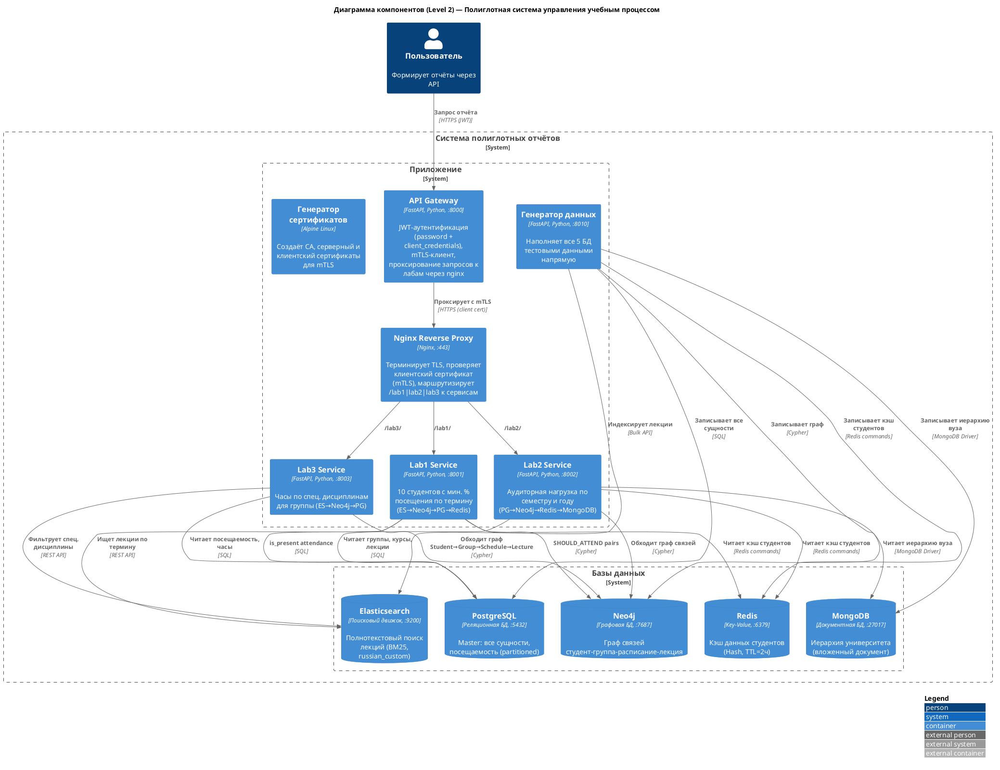

```plantuml
@startuml C4_Containers
!include <C4/C4_Container>

LAYOUT_WITH_LEGEND()

title Диаграмма компонентов (Level 2) — Полиглотная система управления учебным процессом

Person(user, "Пользователь", "Формирует отчёты через API")

System_Boundary(report_system, "Система полиглотных отчётов") {
    System_Boundary(app, "Приложение") {
        Container(gateway, "API Gateway", "FastAPI, Python, :8000", "JWT-аутентификация (password + client_credentials), mTLS-клиент, проксирование запросов к лабам через nginx")
        Container(nginx, "Nginx Reverse Proxy", "Nginx, :443", "Терминирует TLS, проверяет клиентский сертификат (mTLS), маршрутизирует /lab1|lab2|lab3 к сервисам")
        Container(lab1, "Lab1 Service", "FastAPI, Python, :8001", "10 студентов с мин. % посещения по термину (ES→Neo4j→PG→Redis)")
        Container(lab2, "Lab2 Service", "FastAPI, Python, :8002", "Аудиторная нагрузка по семестру и году (PG→Neo4j→Redis→MongoDB)")
        Container(lab3, "Lab3 Service", "FastAPI, Python, :8003", "Часы по спец. дисциплинам для группы (ES→Neo4j→PG)")
        Container(generator, "Генератор данных", "FastAPI, Python, :8010", "Наполняет все 5 БД тестовыми данными напрямую")
        Container(cert_init, "Генератор сертификатов", "Alpine Linux", "Создаёт CA, серверный и клиентский сертификаты для mTLS")
    }

    System_Boundary(dbs, "Базы данных") {
        ContainerDb(pg, "PostgreSQL", "Реляционная БД, :5432", "Master: все сущности, посещаемость (partitioned)")
        ContainerDb(redis, "Redis", "Key-Value, :6379", "Кэш данных студентов (Hash, TTL=2ч)")
        ContainerDb(mongo, "MongoDB", "Документная БД, :27017", "Иерархия университета (вложенный документ)")
        ContainerDb(neo4j, "Neo4j", "Графовая БД, :7687", "Граф связей студент–группа–расписание–лекция")
        ContainerDb(es, "Elasticsearch", "Поисковый движок, :9200", "Полнотекстовый поиск лекций (BM25, russian_custom)")
    }
}

Rel(user, gateway, "Запрос отчёта", "HTTPS (JWT)")
Rel(gateway, nginx, "Проксирует с mTLS", "HTTPS (client cert)")
Rel(nginx, lab1, "/lab1/")
Rel(nginx, lab2, "/lab2/")
Rel(nginx, lab3, "/lab3/")

Rel(generator, pg, "Записывает все сущности", "SQL")
Rel(generator, redis, "Записывает кэш студентов", "Redis commands")
Rel(generator, mongo, "Записывает иерархию вуза", "MongoDB Driver")
Rel(generator, neo4j, "Записывает граф", "Cypher")
Rel(generator, es, "Индексирует лекции", "Bulk API")

Rel(lab1, es, "Ищет лекции по термину", "REST API")
Rel(lab1, neo4j, "SHOULD_ATTEND pairs", "Cypher")
Rel(lab1, pg, "is_present attendance", "SQL")
Rel(lab1, redis, "Читает кэш студентов", "Redis commands")

Rel(lab2, pg, "Читает группы, курсы, лекции", "SQL")
Rel(lab2, neo4j, "Обходит граф связей", "Cypher")
Rel(lab2, redis, "Читает кэш студентов", "Redis commands")
Rel(lab2, mongo, "Читает иерархию вуза", "MongoDB Driver")

Rel(lab3, es, "Фильтрует спец. дисциплины", "REST API")
Rel(lab3, neo4j, "Обходит граф Student→Group→Schedule→Lecture", "Cypher")
Rel(lab3, pg, "Читает посещаемость, часы", "SQL")

@enduml
```
