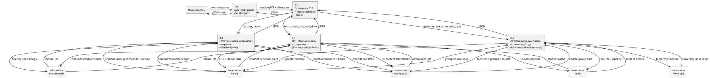

```plantuml
@startuml DFD_Level1
skinparam rectangle {
    BorderColor #000000
    FontSize 12
}
skinparam rectangle<<rounded>> {
    BorderColor #000000
    BackgroundColor #FFFFFF
    FontSize 12
    BorderRadius 15
}
skinparam rectangle<<datastore>> {
    BorderStyle dashed
    BackgroundColor #F9F9F9
    BorderColor #000000
}
skinparam arrow {
    Color #000000
}

rectangle "Пользователь" as User

rectangle "1.0\nАутентификация\nOAuth2 (JWT)" as Auth
rectangle "2.0\nПроверка mTLS\nи проксирование\n(nginx)" as Proxy

rectangle "3.1\nЛР1: Посещаемость\nпо термину\n(ES→Neo4j→PG→Redis)" as Report1
rectangle "3.2\nЛР2: Нагрузка аудиторий\nпо семестру/году\n(PG→Neo4j→Redis→Mongo)" as Report2
rectangle "3.3\nЛР3: Часы спец. дисциплин\nпо группе\n(ES→Neo4j→PG)" as Report3

rectangle "PostgreSQL" as PG <<datastore>>
rectangle "Redis" as Redis <<datastore>>
rectangle "MongoDB" as Mongo <<datastore>>
rectangle "Neo4j" as Neo4j <<datastore>>
rectangle "Elasticsearch" as ES <<datastore>>

User -right-> Auth : логин/пароль
Auth -right-> Proxy : service JWT + client cert
Proxy -down-> Report1 : term, start_date, end_date
Proxy -down-> Report2 : semester, year, computer_type
Proxy -down-> Report3 : group_name

Report1 -down-> ES : полнотекстовый поиск
ES -up-> Report1 : lecture_ids
Report1 -down-> Neo4j : SHOULD_ATTEND
Neo4j -up-> Report1 : student_schedule pairs
Report1 -down-> PG : is_present attendance
PG -up-> Report1 : attendance_pct
Report1 -down-> Redis : HGETALL pipeline
Redis -up-> Report1 : student cache

Report2 -down-> PG : lectures + groups + counts
PG -up-> Report2 : course/group data
Report2 -down-> Neo4j : graph traversal
Neo4j -up-> Report2 : group/course links
Report2 -down-> Redis : HGETALL pipeline
Redis -up-> Report2 : student details
Report2 -down-> Mongo : hierarchy findOne
Mongo -up-> Report2 : university→inst→dept

Report3 -down-> ES : filter by special tags
ES -up-> Report3 : lecture_ids
Report3 -down-> Neo4j : Student→Group→Schedule→Lecture
Neo4j -up-> Report3 : student/course/schedule
Report3 -down-> PG : batch attendance + hours
PG -up-> Report3 : attendance stats

Report1 -up-> Proxy : JSON
Report2 -up-> Proxy : JSON
Report3 -up-> Proxy : JSON
Proxy -left-> Auth : JSON
Auth -left-> User : JSON-отчёт
@enduml
```
